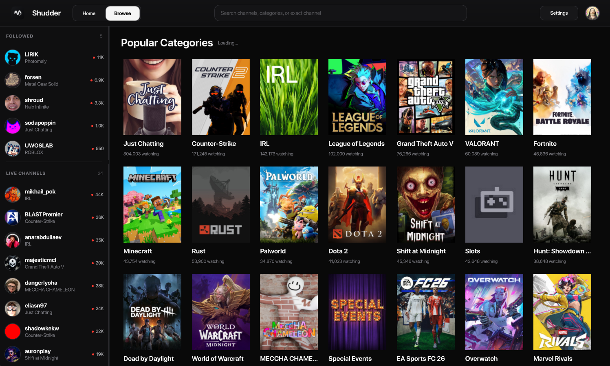
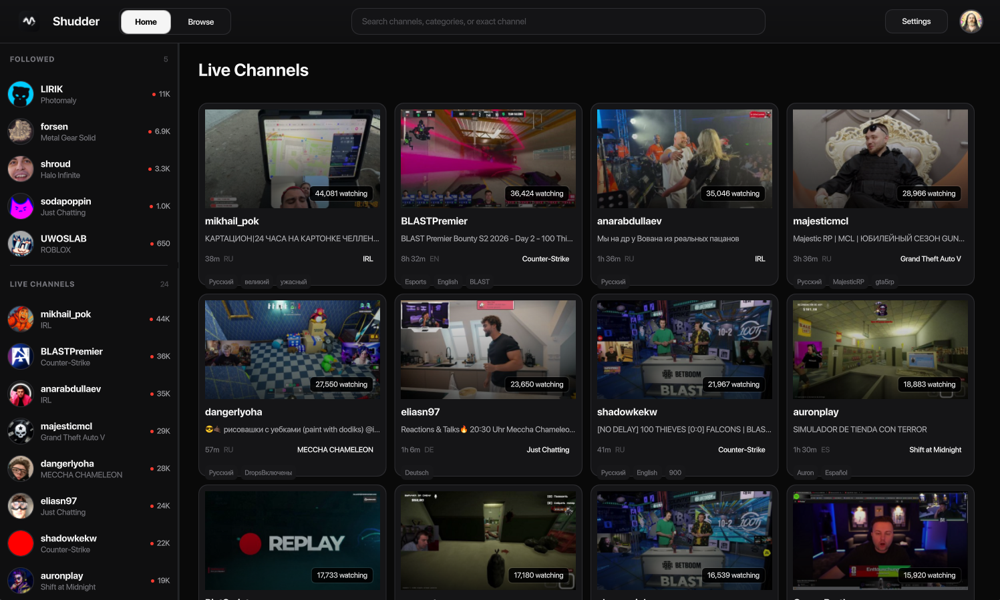
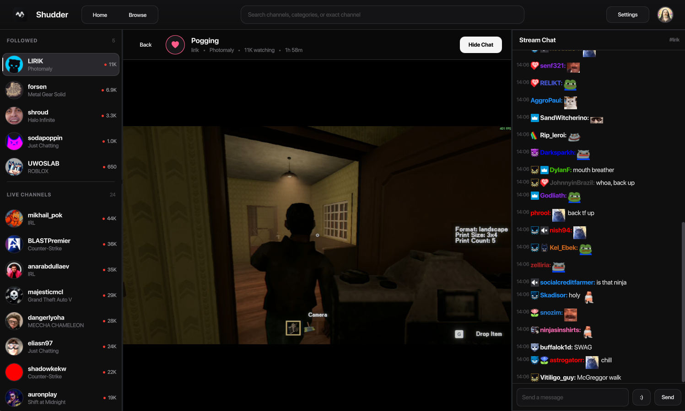

# Shudder

Native Linux Twitch desktop client built with Qt 6, QML, Streamlink, and libmpv.

Shudder is independent and is not affiliated with Twitch.

## Screenshots

### Browse Categories



### Live Channels



### Native Player And Chat



## Features

- Native Qt Quick interface with XDG Base Directory storage and Wayland-first behavior.
- Secret Service storage for OAuth credentials and optional Twitch website-session linking.
- Followed/live channels, browsing, category/channel search, and infinite grid loading.
- Native playback by default through Streamlink and libmpv, with stream-specific quality choices and highest quality by default.
- Standard Twitch playback fallback through Qt WebEngine.
- Native chat with Twitch badges/emotes, 7TV/FrankerFaceZ/BetterTTV emotes, message sending, replies, moderation events, mentions, copy, and jump-to-present.
- Linux packages: AppImage, DEB, RPM, TGZ, Flatpak manifest, desktop entry, AppStream metadata, and hicolor icons.

Shudder does not include an in-app update checker. Install updates through your package manager or by replacing the installed package/AppImage.

## Build

Requirements: CMake 3.24+, Ninja, a C++20 compiler, Qt 6.8+ with Quick/Controls/WebSockets/WebEngine/Test, libmpv, libsecret, Streamlink, and mpv.

```bash
cmake -S . -B build -G Ninja \
  -DCMAKE_BUILD_TYPE=RelWithDebInfo \
  -DSHUDDER_GITHUB_OWNER=fosschad \
  -DSHUDDER_GITHUB_REPOSITORY=Shudder \
  -DSHUDDER_TWITCH_CLIENT_ID=6kt5h1zfzmdv5vre9ios9qfr3lobmq

cmake --build build --parallel "$(nproc)"
ctest --test-dir build --output-on-failure
```

## Package

```bash
cmake --build build --target package
packaging/appimage/build-appimage.sh build
```

Generated artifacts are ignored by git and should be attached to releases or distributed through package repositories.

## Runtime

Native playback discovers Streamlink in this order:

- `SHUDDER_STREAMLINK_PATH`
- bundled `streamlink` beside the installed `shudder` binary, when a package provides one
- system `streamlink` from `PATH`

Runtime data is stored under `shudder` inside the standard XDG config, data, cache, state, and runtime directories.

## License

Shudder is GPL-3.0-or-later. Third-party notices are in `THIRD_PARTY_NOTICES.md`.
